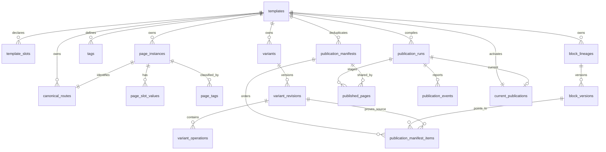

# ADR 0001: Application-owned immutable materialization on TiDB

- Status: **Accepted**
- Date: 2026-08-29
- Linear issue: [AUT-532](https://linear.app/harwood/issue/AUT-532/translate-prototype-findings-into-a-tidbauteur-materialization-adr)
- Evidence ledger: [Prototype benchmark report](../benchmarks.md)
- Process model: [Auteur process-engineering guide](../process-engineering-guide.md)
- Standalone delivery proof:
  [AUT-534](https://linear.app/harwood/issue/AUT-534/prove-sqlite-publication-with-a-standalone-tanstack-website-renderer)
- Hybrid-route isolation proof:
  [AUT-535](https://linear.app/harwood/issue/AUT-535/add-the-hybrid-admin-gateway-and-isolated-website-preview-route)

## Context

Auteur needs an expressive relational authoring model and a deterministic, cacheable serving model.
Those are different workloads:

- authoring joins page slots, tags, selector revisions, sparse operations, and immutable block
  versions so an author can inspect and change layered content;
- serving resolves a canonical URL to one already-compiled document without evaluating selectors;
- publication is the controlled boundary that turns the first shape into the second.

TiDB ordinary views are virtual; the stable product documentation linked from Linear does not offer
a native materialized-view contract that can be assumed here. Auteur must own explicit publication
tables and their refresh lifecycle. The selected TiDB version or edition must be verified again
before implementation; a future product feature does not silently change this ADR.

The linked stable documentation was rechecked on 2026-08-29 (TiDB Self-Managed v8.5): querying a
view executes its defining `SELECT`, and materialized views are listed as unsupported. The same
review records a default 100 MB transaction-size limit (configurable, with memory consequences),
which reinforces the hidden chunk namespace plus short activation transaction instead of making a
million-page build depend on one transaction.

During migration, RouterService remains the authority for route identity and `live`, `not_live`, or
`archived` status. Auteur owns content, selector evaluation, materialization, and provenance. The
new serving path removes Content Service `multiResolve` for content managed by Auteur.

## Decision

Adopt a hybrid of the Linear options:

1. Keep normalized, template-scoped authoring tables as the authoritative editable state.
2. Run an application-orchestrated publication compiler. It may use TiDB set operations such as
   `INSERT … SELECT`, but Auteur owns snapshot selection, selector validation, conflict detection,
   chunking, retry, validation, and activation.
3. Write each build into an unpublished `publication_id` namespace. Chunk transactions are
   idempotent; incomplete namespaces are never visible to public reads.
4. Store immutable page-to-manifest pointers, content-addressed structural manifests, winning block
   versions, page context, and per-placement provenance.
5. Activate or roll back with one short, compare-and-swap transaction on the template's current
   publication pointer. Retain the former pointer target.
6. Use a full-template rebuild as the initial correctness baseline. Add incremental compilation only
   after dependency capture and affected-page equivalence are proven against full rebuilds.
7. Keep deterministic interpolation compatible with structural manifest sharing. Whether the hot
   serving row also stores a fully expanded payload is an evidence-gated optimization.
8. Expose a strict, versionable published-document contract to renderers. Stable placement keys,
   contiguous order, immutable block-version pointers, and winning provenance are validated before
   a block registry receives the document; malformed materialization fails closed.

This is the accepted production direction from the prototype, not a production scale or SLO claim.
The committed one-million envelope and successful five-phase result in `docs/benchmarks.md` support
the boundary; the named TiDB proof spikes remain prerequisites for production implementation.

## Decision drivers

- One canonical URL must have one effective document and stable hash for identical inputs.
- Same-priority operations on the same placement must fail publication; row order is never a
  tiebreaker.
- Public requests must execute zero selector SQL.
- A partially written large publication must be invisible.
- Activation and rollback must be bounded operations independent of publication cardinality.
- Block and publication history must remain explainable through provenance.
- The RouterService route revision used by a publication must be recorded.
- The design must work when a single database transaction is too large for the publication.
- SQLite measurements compare data shapes; they do not establish TiDB production SLOs.

## Evidence gate

The decision is conditioned on measured evidence. Values below come from the generated evidence
envelopes; the envelopes remain canonical for exact provenance and host-dependent measurements,
while selected counts and measurements are repeated here for the architectural comparison.

| Required input | Result | Decision it informs |
| --- | --- | --- |
| Dense Eligible Vehicles page count, compile time, conflicts, unique manifests, bytes | Bounded proof: 24 pages, 24 manifests, 168 expanded/stored placements, 22,024 expanded/stored canonical bytes, exact operation provenance on all 168 items, 218 persisted rows and 16,520 estimated serialized bytes, 114,688 allocated bytes added, and a conflict rejected with no partial rows. Timing is in the envelope. | Full rebuild remains legible when sharing is low; manifest indirection supplies provenance but no storage win for this dense shape. |
| Sparse Store development shape | Bounded proof: 1,002 pages, five manifests, 997 reused pages, 4,008 logical versus 20 stored placements, and 830,021 versus 4,214 canonical structure bytes. Expanded rendered documents total 1,142,964 logical bytes; estimated manifest plus page rows total 508,807 bytes; actual SQLite allocation still grows by 782,336 bytes after table/index overhead. A seed replay inserts zero pages without changing the identity hash, page count, or membership count. | Sparse layers make structural manifests promising, but the bounded database does not demonstrate an end-to-end allocation saving; per-page context/rendered JSON and physical overhead remain separate costs. |
| Selector preview and overlap shape | Four persisted tag selectors match 501 chain, 201 fast-food, 50 Burger King, and 51 McDonald's pages through indexed plans. Pairwise diagnostics expose the shared `primary-hero` write of the two disjoint priority-30 brand layers. | Keep full match counts separate from samples, retain explicit operation-overlap diagnostics, and never infer precedence from selector specificity. |
| Interpolation and mutation propagation | Two McDonald's pages share a manifest while rendered text and document hashes differ. Fast-food promo changes reach both brands without replacing their heroes; a McDonald's hero edit leaves Burger King and default heroes unchanged. | Manifest identity excludes page interpolation values; incremental invalidation needs both selector and interpolation dependency capture. |
| One-million Store seed/publication, tag plans, manifest reuse, database bytes | Clean governed commit `45dc188` (AUT-527–AUT-530 scenario evidence refreshed to the AUT-554 lockfile): 1,000,000 scale rows plus two foundation pages; 4,000,008 slot rows; 1,300,004 tag memberships; healthy schema v7 with zero FK violations; all canonical/tag/selector plans indexed; 64.034 s seed; 662.074 s publication; 339.440 s idempotent republish; five manifests for 1,000,002 pages; 2,694,868,992 final database bytes; 797,458,432 publication-allocation bytes; 589,398,016 maximum resident bytes. | The full-template baseline completed within local resources. Keep the compiler batched, carry progress and idempotency metadata into TiDB, preserve the covering membership and canonical indexes, and test Region/hot-key behavior before choosing partitions. |
| Structural replacement inheritance and hashes | 24 default placements; 23 effective; 22 unchanged pointers (`91.67%`); stable `primary-hero` changes `hero` → `hero_alt`; two persisted publications contain four page documents, two manifests, and 47 manifest items; publication adds 28,672 allocated bytes; rollback restores the baseline hash. | Placement-key overlays avoid cloning unrelated block content. |
| Canonical URL latency and SQL count | The envelope records bounded and one-million p50/p95 samples. The structural-manifest read uses two fixed SQL statements per request; the expanded public read uses one. Both execute zero selector statements and use indexed canonical lookup. | Serving index and expanded-versus-manifest read shape. |
| Expanded page payload versus shared manifest storage | Bounded Store structural bytes remove 825,807 repeated canonical bytes. At one million, five manifests replace 4,000,008 logical placement rows with 20 stored rows and remove 828,397,407 repeated canonical structure bytes. Fully expanded rendered documents total 1,143,681,174 bytes versus a 507,791,017-byte manifest/page estimate, while actual publication allocation is 797,458,432 bytes after SQLite table/index overhead. | Structural sharing is real, but physical database savings are not equal to the logical ratio. Retain the hybrid option and compare cache behavior, context size, secondary indexes, and compression in `TIDB-STO-04`. |
| Failure injection and rollback hash equality | Store, dense, and structural persisted proofs preserve the prior pointer, create no partial failure rows, and restore the exact baseline hash. | Retry, seal, activation, and recovery contract. |

The measured shapes support the selected boundary, not TiDB throughput. The named TiDB proof spikes
remain mandatory even after the local one-million run passes.

## Standalone application proof

`apps/website` makes the authoring/serving boundary executable in a second TanStack Start
application instead of demonstrating it only inside the CMS HUD:

- the public catch-all maps one supported canonical path and host to one template, opens SQLite
  read-only, calls `CmsService.serve`, validates `PublishedDocumentSchema`, and synchronously
  dispatches `navigation`, `hero`, `hero_alt`, `promo`, and `footer` through a shared block registry;
- the three deterministic compact publications render Store
  (`/en-US/store/1001`), Eligible Vehicles
  (`/en-US/eligible-vehicles/ca/premium`), and structural replacement
  (`/en-US/airport/hero-alt`), including the stable-key `hero` to `hero_alt` swap;
- expanded and manifest serving remain bounded at one or two SQLite statements respectively, with
  zero selector statements;
- `/cms-preview_/*` is a separate no-store/noindex authoring-resolution lane. A public
  `edit_mode` query is discarded and cannot expose a draft;
- `/admin` validates `CMS_ADMIN_ORIGIN` and offers a handoff to the separately deployed CMS. It is
  not an iframe, reverse proxy, API gateway, or authentication endpoint.

This local topology follows the useful separation shown by Median, but it is evidence for the data
boundary, not a production deployment design. Production preview
authentication and authorization, host/origin routing, serving/database credentials, CDN cache
keys and invalidation, and rollback-aware edge purge behavior remain open decisions. Preview fails
closed outside development/test unless explicitly enabled; localhost host exceptions exist only for
deliberate production-mode smoke tests.

## Authoritative and serving schemas

### Authoring state

The production authoring schema retains the prototype's logical entities:

- `templates`, `template_slots`
- `route_ingestions`, `page_instances`, invariant `canonical_routes`, `page_slot_values`
- `tags`, `page_tags`, `route_audit_log`
- `variants`, immutable `variant_revisions`, immutable `variant_operations`
- `block_types`, `block_lineages`, immutable `block_versions`

Normalized slot and tag relations remain authoritative because they preserve arbitrary dimensions,
many-to-many membership, provenance, and template isolation. Hot production projections may use
generated columns or maintained selector-read tables, but those are derived indexes, not a second
editable truth.

Because the prototype stores an absolute path in `page_instances.canonical_url` while the domain
lives on `templates`, production should materialize route ownership in a small unpartitioned
`canonical_routes(domain, canonical_path, template_id, page_instance_id, route_external_id)` table.
Its unique domain/path and route-identity keys replace SQLite's cross-table domain/path triggers;
RouterService remains the source of the values, and the ingestion transaction updates this ownership row
together with the page instance. This is an invariant projection, not another editable route truth.

### Serving read model

The TiDB model separates build orchestration from immutable results:

- `publication_runs`: idempotency key, input snapshot/hash, route revision, build state, chunk
  progress, counts, validation result, and timings.
- `publication_manifests`: one template-scoped structural content hash.
- `publication_manifest_items`: ordered block-version pointers plus winning revision/priority.
- `published_pages`: one canonical URL/page pointer, manifest, immutable context, document hash, and
  optional fully expanded payload inside one publication namespace.
- `current_publications`: one active publication pointer per template.
- `publication_events`: append-only start, chunk, validation, activation, rollback, and failure
  observations.

The first TiDB DDL spike should preserve at least this physical contract (exact string lengths,
binary encodings, JSON type choices, and constraint support remain version-verification items):

| Table | Required columns | Primary/unique contract |
| --- | --- | --- |
| `canonical_routes` | `domain`, `canonical_path`, `template_id`, `page_instance_id`, `route_external_id`, `route_status`, `source_revision`, `source_observed_at` | PK `(domain,canonical_path)`; unique `route_external_id`; unique `page_instance_id`; FKs to template/page where the selected TiDB version enforces them. |
| `publication_runs` | `id`, `template_id`, `sequence`, `input_hash`, `input_snapshot_json`, `compiler_version`, `route_revision`, `state`, `prior_publication_id`, count/timing/error fields, created/sealed/activated timestamps | PK `id`; unique `(template_id,sequence)`; unique `(template_id,input_hash,compiler_version)`; state transition enforced by publisher role/service and append-only events. |
| `publication_manifests` | `id`, `template_id`, `manifest_hash`, `placement_count`, `canonical_bytes`, `created_at` | PK `id`; unique `(template_id,manifest_hash)`; immutable after insert. |
| `publication_manifest_items` | `manifest_id`, `placement_key`, `ordinal`, `block_version_id`, `source_variant_revision_id`, `source_operation_id`, `source_priority` | PK `(manifest_id,placement_key)`; unique `(manifest_id,ordinal)`; immutable same-template winner/provenance pointers. |
| `published_pages` | `publication_id`, `template_id`, `page_instance_id`, `canonical_path`, `route_status`, `route_revision`, `manifest_id`, `context_json`, `document_hash`, optional `expanded_payload_json` | PK `(publication_id,page_instance_id)`; unique `(publication_id,canonical_path)`; all publication/template/manifest ownership keys agree. |
| `current_publications` | `template_id`, `publication_id`, `activated_at`, `activated_by`, pointer revision/CAS token | PK `template_id`; unique `publication_id`; target must be a validated run for the same template. |
| `publication_events` | `publication_id`, `event_sequence`, `event_type`, chunk boundary/attempt, count/timing fields, bounded diagnostic JSON, `occurred_at` | PK `(publication_id,event_sequence)`; append-only; event idempotency key where a retry can repeat an observation. |

Build credentials may insert into a hidden publication namespace but cannot change the current
pointer. A narrowly scoped activator credential may perform only the guarded pointer transaction.
Serving credentials read `canonical_routes`, `current_publications`, and immutable result tables;
they cannot read selector/authoring inputs or write any publication row.



The physical design may retain manifests across publication runs when `(template_id, manifest_hash)`
is identical. A published page still records the exact publication, effective document hash, route
revision, and immutable context used to render it.

## Publication protocol

### Snapshot and idempotency

The compiler creates an immutable input descriptor containing at least:

- template and slot definition revisions;
- RouterService route source revision;
- page/context and tag-assignment watermark;
- active variant IDs, priorities, revision IDs, normalized selector hashes, and operation hashes;
- referenced block-version IDs and schema versions;
- compiler version and interpolation semantics version.

Canonical encoding produces `input_hash`. A unique idempotency key such as
`(template_id, input_hash, compiler_version)` causes a retry to resume or return the existing sealed
run instead of creating a competing result. Changing any input creates a new run.

### Chunked compile, validation, and activation

```mermaid
sequenceDiagram
  participant Orchestrator as Auteur publisher
  participant TiDB
  participant Validator
  participant Serve as Serving fleet

  Orchestrator->>TiDB: Create publication_run(input_hash, snapshot, building)
  loop deterministic page-key ranges
    Orchestrator->>TiDB: Evaluate approved selectors for chunk
    Orchestrator->>Orchestrator: Detect conflicts + resolve + canonicalize
    Orchestrator->>TiDB: Idempotent insert manifests/items/pages under publication_id
    Orchestrator->>TiDB: Append chunk event + checkpoint
  end
  Orchestrator->>Validator: Validate counts, hashes, provenance, route revision, random reads
  Validator->>TiDB: Seal run as validated or failed
  alt validation failed
    TiDB-->>Serve: Current pointer remains unchanged
  else validation passed
    Orchestrator->>TiDB: BEGIN; lock/CAS current pointer; activate; append event; COMMIT
    TiDB-->>Serve: New pointer visible atomically
  end
  opt rollback
    Orchestrator->>TiDB: BEGIN; CAS pointer to retained validated run; append event; COMMIT
    TiDB-->>Serve: Exact former hashes become current
  end
```

Large builds do not rely on one transaction. Every chunk uses deterministic page boundaries and
upserts only rows whose keys include `publication_id`; a retry verifies the same hash before
accepting an existing row. A mismatch is corruption and fails the run.

After every chunk is present, validation recomputes expected page and manifest counts, verifies no
duplicate canonical URLs or placement keys, checks that every winner has provenance, confirms the
route revision, samples full document hashes, and proves that the proposed publication is still
based on the intended authoring snapshot.

Activation is the only operation on the public visibility path:

```sql
UPDATE current_publications
SET publication_id = :next_publication_id,
    activated_at = CURRENT_TIMESTAMP,
    activated_by = :actor
WHERE template_id = :template_id
  AND publication_id = :expected_previous_publication_id;
```

The publisher checks that exactly one row changed and commits the pointer update plus activation
event in one short transaction. First publication uses an equivalent guarded insert. A concurrent
authoring change does not mutate the sealed run; policy decides whether it may activate as a known
snapshot or must be superseded.

### Failure recovery and cleanup

| Failure | Required behavior |
| --- | --- |
| Selector parse/safety failure | Fail before query execution; write diagnostic event; current pointer unchanged. |
| Same-priority conflict | Record page, placement, priority, variant revisions, and operation kinds; no activation. |
| Worker dies during chunk | Resume from deterministic checkpoint using the same idempotency key; existing row hashes must match. |
| Chunk statement fails | Roll back that chunk transaction only; earlier hidden chunks remain resumable. |
| Validation count/hash mismatch | Mark the run failed; current pointer unchanged; preserve evidence until investigated. |
| Pointer compare-and-swap loses | Do not overwrite the winner; re-read current state and require an explicit retry/rebase. |
| Client loses activation response | Read the pointer and activation event using the idempotency key before retrying. |
| New publication is bad after activation | Point to the retained previous validated publication; do not rewrite page rows. |
| Cleanup fails | Serving is unaffected; retry cleanup asynchronously after retention and rollback guarantees permit it. |

Observability must include run/input IDs, template, route revision, compiler version, chunk range,
attempt, rows read/written/reused, selector timings/plans, conflicts, validation failures, pointer
from/to, actor, and end-to-end duration. Metrics and logs must not contain unrestricted author
content or page context.

## Selector safety in TiDB

Selectors remain a constrained DSL, not SQL fragments:

1. Parse into an AST with expression and token bounds.
2. Resolve fields through a template-owned allowlist and dependency registry.
3. Compile trusted identifier mappings; bind every authored scalar value.
4. Inject `template_id` and route-status policy outside author input.
5. Lower tag predicates to indexed membership `EXISTS`/joins on the approved read surface.
6. Reject DDL, DML, comments, multiple statements, functions, subqueries, unauthorized tables, and
   fields outside the template.
7. Run bounded preview under a read-only database role with row and time limits. Capture `EXPLAIN`
   without accepting author hints.
8. Run publication from a worker role. Public serving credentials have no access to selector or
   normalized authoring tables.

Selector normalization and hashing remain application code shared by SQLite and TiDB. SQL text is a
backend output; it is never the canonical selector identity.

## Index and partition strategy

### Required indexes

| Access path | Candidate TiDB index | Reason / validation |
| --- | --- | --- |
| Route identity | unique `canonical_routes(domain,canonical_path)`; unique `canonical_routes(route_external_id)`; unique `canonical_routes(page_instance_id)` | Enforces one normalized absolute URL, one RouterService identity, and one ownership row per page without relying on a cross-table trigger. Explain domain/path lookup. |
| Template page scan | `page_instances(template_id, route_status, id)` | Stable keyset pagination and deterministic publication chunks. |
| Scalar selector | `page_slot_values(template_id, slot_id, normalized_value, page_instance_id)` | Equality/`IN` membership restricted to one template. |
| Tag definition | unique `tags(template_id, namespace, value)` | Resolves authored tag name to an ID. |
| Tag-to-page | `page_tags(template_id, tag_id, page_instance_id)` | Indexed selector membership and counts. |
| Page-to-tags | `page_tags(template_id, page_instance_id, tag_id)` | Vertical-pin inspection and invalidation for one page. The SQLite prototype's primary key is not a substitute for measuring this direction in TiDB. |
| Active layers | `variants(template_id, status, priority, id)` plus unique revision number | Deterministic layer scan and revision history. |
| Operations | `variant_operations(variant_revision_id, placement_key, operation_kind)` | Read one immutable layer and diagnose overlap. |
| Current serve | PK `current_publications(template_id)` | One bounded pointer lookup. |
| Page in publication | unique `published_pages(publication_id, canonical_path)` and `(publication_id,page_instance_id)` | One effective path/page in a template-scoped run; domain comes from the run's template and canonical ownership row. |
| Manifest reuse | unique `publication_manifests(template_id, manifest_hash)` | Content-addressed structural reuse. |
| Manifest read | PK/index `(manifest_id, ordinal)` and unique `(manifest_id, placement_key)` | Ordered fetch with no duplicate placement. |
| Retention/cleanup | `publication_runs(template_id, state, created_at, id)` | Find former or failed runs without touching hot serve keys. |

The structural-manifest serving path should take at most two database round trips before caches:
one join from `current_publications` to `published_pages`, then one ordered manifest/block join. A
fully expanded serving row can be one query. Both execute zero selectors; the benchmark decides
whether the extra manifest lookup is justified by reuse.

### Partition strategy

Do not partition every table preemptively. Template ownership is the logical locality key, but
global domain/path ownership and workload-skewed templates make a naive template partition risky.
The initial TiDB proof should use ordinary tables and the indexes above, then measure Region/key
distribution, hotspots, and plans.

First candidates, only if measurements justify them:

- hash/key partition `published_pages` by a stable publication/page key to spread large immutable
  writes while retaining publication-scoped lookup indexes;
- partition old `publication_runs`/events by time for retention if scans and cleanup require it;
- hash partition very large selector membership tables only if pruning and both lookup directions
  are proven.

Keep `canonical_routes` unpartitioned unless a later proof establishes an equivalent TiDB global
index. Global-index behavior is version/edition specific and must be a named proof, not an
assumption. Record `EXPLAIN`, Region distribution, write amplification, and lookup RPCs before
adopting a partition scheme.

## Incremental invalidation matrix

Full-template rebuild remains the oracle. An incremental run must produce byte-identical pages,
manifests, hashes, and provenance to that oracle.

| Changed input | Minimum affected set | Required dependency/evidence | Default fallback |
| --- | --- | --- | --- |
| Template URL grammar or slot definition | Every page in template | Template/slot revision in snapshot | Full template |
| Default operation, order, or block version | Every page that inherits the placement; conservatively all template pages | Reverse winner/dependency index | Full template |
| Page scalar/context value | That page plus any selector whose dependency fields changed | Selector-field registry; interpolation dependency list | Rebuild page; full template if dependency unknown |
| Page tag assignment | That page and selectors dependent on that tag namespace/value | Selector-tag dependency registry | Rebuild page |
| Selector expression or active status | Union of old and new match sets | Retained selector-match bitmap/table for both revisions | Full template |
| Variant priority | Union of pages matching that variant and overlapping layers | Match set plus placement overlap index | Full template |
| Variant operation | Pages matching that variant; expand for same-placement conflict checks | Match set and operation-placement index | Full template |
| New block version selected by an operation | Pages matching revisions that point to it | Block-version-to-operation reverse index | Full template |
| Block schema/interpolation semantics | Every page using affected versions | Version/schema dependency and compiler version | Full template |
| RouterService route insert | New page if eligible | Route revision and complete slot/tag inputs | Rebuild page |
| RouterService status change | That route, with explicit `not_live`/`archived` policy | Route audit and revision | Rebuild or remove page pointer in next publication |
| RouterService canonical URL change | Old and new canonical identities; uniqueness revalidation | Stable external route identity | Full template if identity is ambiguous |
| Compiler version | Every page whose canonical encoding/semantics can change | Compiler compatibility declaration | Full template |

Incremental publication is rejected until randomized equivalence tests compare it with full rebuilds
across overlapping selectors, tombstones, reorders, type replacements, tag changes, and failures.

## Prototype-to-production migration map

| SQLite/Drizzle prototype | TiDB/Auteur target | Portability work |
| --- | --- | --- |
| `@repo/cms-db` with `bun:sqlite` | Same repository boundary with a TiDB/MySQL-compatible driver | Keep domain/service interfaces; replace connection, transaction, and query-plan adapters. Browser code still crosses a TanStack/server API boundary. |
| `templates`, `template_slots` | Same logical tables with revision/snapshot identity | Choose binary collation for IDs/keys; add explicit revision columns if snapshots cannot rely on watermarks. |
| `route_ingestions`, `page_instances`, `route_audit_log` | RouterService adapter/import tables, unpartitioned `canonical_routes` ownership projection, and append-only route events | Replace SQLite upsert syntax and domain/path triggers with a transactionally maintained unique ownership row; preserve immutable `source_observed_at`; define archived-reactivation authorization and source-revision idempotency. |
| `page_slot_values` | Normalized authoritative slots plus optional derived selector projection | Replace SQLite JSON/text assumptions; benchmark normalized joins versus generated/wide fields. |
| `tags`, `page_tags` | Same M:N source-of-truth relations | Add both lookup-direction indexes and source/freshness policy. |
| `variants`, `variant_revisions`, `variant_operations` | Same logical immutable-revision model | Replace SQLite partial unique default index with a `template_defaults` ownership table or transactional service invariant. Freeze operations with service permissions/audit, not trigger assumptions alone. |
| `block_types`, `block_lineages`, `block_versions` | Same registry, lineage, and immutable versions | Use native JSON where appropriate; canonical content hash remains application-generated. |
| `publications` | `publication_runs` plus sealed immutable publication namespace | Add `building`, `validated`, `failed`, `activated`, and rollback events without mutating result rows. |
| `document_manifests`, `document_manifest_items` | `publication_manifests`, `publication_manifest_items` | Preserve template-scoped hash, order, block pointer, and source revision/priority. |
| `published_page_documents` | `published_pages` | Choose structural context plus optional expanded payload after measurements; retain route revision and document hash. |
| `current_publications` | Same one-row-per-template activation pointer | Implement guarded insert/CAS update in a short transaction and retain prior target. |
| SQLite checks/triggers/FKs | TiDB constraints where verified, plus service transactions, roles, and audit checks | Verify selected TiDB version for `CHECK`, FK, JSON, partitioned unique indexes, and trigger differences. Never weaken the invariant because syntax differs. |
| SQLite `INSERT OR IGNORE`, PRAGMA, JSON1, partial indexes | TiDB/MySQL dialect and operational tooling | Rewrite migrations explicitly; no dialect string substitution. Maintain backend-specific integration tests. |

The Drizzle schema is a prototype schema, not a guarantee that one generated migration can target
both engines. Keep portable domain interfaces and canonical hash/selector logic, while maintaining
reviewed backend-specific SQL migrations.

## Alternatives considered

### Native ordinary view as the serving model — rejected

It would recompute joins/selectors on read and does not supply a persisted materialized result. It
violates the selector-free public path and provides no publication pointer or rollback artifact.

### One giant publication transaction — rejected as a scale requirement

It is simple in SQLite but makes million-row publication dependent on transaction size, memory,
lock duration, and retry behavior. TiDB supports transactions, but its stable documentation records
a default 100 MB total transaction limit and higher process-memory amplification; hidden chunk
namespaces plus a short pointer transaction give a bounded visibility operation.

### Fully expanded payload for every page — retained as a measured option

It minimizes read joins and can make one-query serving simple, but duplicates structure and may
amplify publication writes. It may still win for dense templates or for an edge-oriented payload.
The benchmark must compare actual bytes and latency.

### Structural manifests only — chosen baseline, not universal dogma

They exploit sparse Store sharing and retain block-level provenance. They add a manifest lookup and
may save little in dense variation. The serving cache and optional expanded payload must be decided
from measurements.

### Incremental-only compiler — rejected initially

Without complete selector and interpolation dependencies, a missed affected page is a silent stale
document. Full rebuild supplies a correctness oracle; incremental mode is an optimization with
equivalence tests.

### Selector specificity as precedence — rejected

Selector complexity is not an author contract and would couple correctness to parser evolution.
Only explicit priority decides precedence; same-priority same-placement overlap fails.

## Consequences

### Positive

- Serving cost is bounded and independent of selector complexity.
- A publication is inspectable, hashable, cacheable, and reversible.
- Large writes can be chunked without exposing partial state.
- Manifests can deduplicate sparse structures while page context remains explicit.
- The normalized authoring model remains expressive and queryable.
- RouterService transition state and Auteur content state have a recorded revision seam.

### Costs and risks

- Publication storage and orchestration are first-class product infrastructure.
- Snapshot and invalidation metadata must be designed, not inferred later.
- Chunk retries, sealing, retention, and cleanup need operational tooling.
- Manifest reuse trades write savings for a second read/cache surface.
- Database constraints and immutability enforcement differ between SQLite and TiDB.
- RouterService status drift requires an explicit serving and republish policy.
- A large or skewed template can hotspot keys even when total row count is acceptable.
- The local `/admin` handoff and `/cms-preview_/*` isolation do not supply production
  authentication, authorization, or tenant routing.
- Public cache headers prove cacheability, but CDN keying, invalidation, purge-on-rollback, and
  deployment topology still require an operational contract.

## Required TiDB proof spikes

These are named blockers, not implied guarantees:

1. **TIDB-MAT-01 — Chunk and activation proof:** build a representative million-page publication in
   chunks, inject failures, retry, CAS-activate, and rollback while readers observe only whole
   versions.
2. **TIDB-SEL-02 — Selector plan proof:** load dense scalar and sparse tag distributions; record
   `EXPLAIN ANALYZE`, timeouts, memory, and both tag lookup directions.
3. **TIDB-IDX-03 — Partition/global-index proof:** compare unpartitioned and candidate partitioned
   `published_pages`; verify canonical uniqueness, pruning, Region distribution, hotspots, and
   selected version/edition support.
4. **TIDB-STO-04 — Manifest storage proof:** compare expanded payloads, structural manifests, and a
   hybrid using real block/context sizes and cache behavior.
5. **TIDB-INV-05 — Incremental equivalence proof:** mutate every row type in the invalidation matrix
   and require byte equality with a full rebuild.
6. **TIDB-CON-06 — Constraint/immutability proof:** map every SQLite check, partial unique index,
   composite FK, and trigger to verified TiDB DDL or explicit service/permission tests.
7. **TIDB-ROUTER-07 — Route revision seam:** define and test behavior for status changes during build,
   stale route revisions at request time, archived reactivation, and rollback.

## References

- [TiDB views](https://docs.pingcap.com/tidb/stable/views/)
- [TiDB transaction overview](https://docs.pingcap.com/tidb/stable/transaction-overview/)
- [TiDB partitioning](https://docs.pingcap.com/tidb/stable/partitioned-table/)
- [TiDB `CREATE TABLE` and global-index compatibility notes](https://docs.pingcap.com/tidb/stable/sql-statement-create-table/)
- [CMS project](https://linear.app/harwood/project/cms-d9fccc6885e7/overview)

## Acceptance status

The architecture, ERD, index/partition proposal, publication sequence, invalidation matrix, migration
map, failure contract, and proof spikes are present. Bounded and one-million dense/sparse/structural,
query-plan, storage-shape, atomic-failure, rollback, and selector-free serving evidence is executable.
The one-million envelope introduced no local resource blocker, and the complete five-phase gate
passed from the clean AUT-554 delivery tree on 2026-08-31. The ADR is accepted with its TiDB proof
spikes and production-assumption limits intact. AUT-534 and AUT-535 extend the local evidence with a
standalone renderer and isolated hybrid routes; they do not close the production authentication,
deployment, credential, or cache-policy decisions named above.
