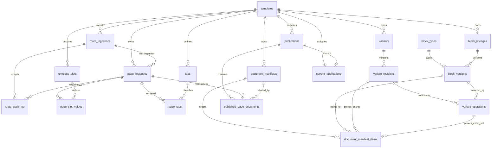

# Auteur prototype data model

Linear issue: [AUT-516](https://linear.app/harwood/issue/AUT-516/design-the-generic-relational-schema-and-authoring-serving-boundary)

Executable delivery proofs:
[AUT-534](https://linear.app/harwood/issue/AUT-534/prove-sqlite-publication-with-a-standalone-tanstack-website-renderer)
and
[AUT-535](https://linear.app/harwood/issue/AUT-535/add-the-hybrid-admin-gateway-and-isolated-website-preview-route)

This reference describes the current SQLite/Drizzle foundation in
`packages/cms-db/drizzle/0000_slot_variant_foundation.sql`,
`packages/cms-db/drizzle/0001_authoring-contract.sql`,
`packages/cms-db/drizzle/0002_block-version-parent-provenance.sql`,
`packages/cms-db/drizzle/0003_domain-path-canonical-identity.sql`,
`packages/cms-db/drizzle/0004_selector-validation-and-preview-metadata.sql`,
`packages/cms-db/drizzle/0005_route-source-observed-at.sql`, and
`packages/cms-db/src/schema/index.ts`. It is the table-level companion to the
[process-engineering guide](./process-engineering-guide.md).

## The boundary in one sentence

Normalized template, route, slot, tag, variant, operation, and block rows are authoring inputs;
publication compiles them into immutable manifests and page documents selected by one mutable
current-publication pointer.

There is **no route-tree content inheritance** in this model. A URL path is represented by ordered
slots, but parent/child path position never determines content precedence. Inheritance comes only
from one template-owned default plus matching selector variants with explicit integer priority.
Camo Press remains the route identity/status authority at the transition seam.

### Executable publication-document contract

The relational rows are not passed loose to React. `packages/cms-domain/src/published-document.ts`
defines the strict `PublishedDocumentSchema` used at publication persistence and at both expanded
and manifest serving boundaries:

```text
PublishedDocument
  templateId
  pageId
  placements[]
    placementKey       stable document position
    order              zero-based and contiguous
    blockType          registry dispatch key
    blockVersionId     immutable content version
    content            rendered JSON object
    provenance
      sourceRevisionId
      sourceOperationId
      sourcePriority
```

Unknown fields, duplicate placement keys, gaps in order, and missing provenance fail parsing rather
than becoming partially rendered public output. `apps/website` then consumes the validated value
through one shared block registry. Block-type replacement changes `blockType` and
`blockVersionId` at the same `placementKey`; it does not invent a new page position or clone the
unaffected placements.

## Relational overview



The migration uses composite foreign keys containing `template_id` where a cross-template pointer
would violate the product model. Application services must keep that boundary even when a future
database cannot express one of the prototype constraints identically.

## All 19 domain tables

The “owner” column names the subsystem allowed to create or change the row. Direct SQL is useful for
tests, but is not an alternate ownership path.

| # | Table | Row meaning and owner | Lifecycle | Primary relationships, constraints, and indexes |
| ---: | --- | --- | --- | --- |
| 1 | `templates` | One domain plus URL grammar/content map. Template administration owns it. | Mutable metadata and active/archived status; stable identity. | PK `id`; unique `key` and `(domain,url_pattern)`; normalized bare-host domain plus pattern/status checks; every dependent content row stays template-scoped. |
| 2 | `template_slots` | One static, variable, or derived scalar dimension. Template administration owns it. | Mutable model input; changes can require route re-ingestion/publication. | PK `id`; FK `template_id`; unique template/key and template/path position; kind-shape and non-negative-position checks; `(template_id,path_position)` lookup. |
| 3 | `route_ingestions` | One idempotent Camo or seed import attempt. Route ingestion owns it. | Append-oriented; immutable `source_observed_at` records when the source state was observed; `running` closes as `succeeded` or `failed`. | PK `id`; FK template; unique `(template_id,source,source_revision)`; required source-observation timestamp; template/status index; completion-shape and row-count checks. |
| 4 | `page_instances` | One stable Camo route identity and canonical path inside a template/domain. Route ingestion owns it. | Mutable authoring input; lifecycle status changes by authoritative import. | PK `id`; FK template and last ingestion; unique external ID, `(template_id,canonical_url)`, and `(template_id,slot_value_hash)`; domain-plus-path uniqueness triggers; JSON context and absolute-path checks; `(template_id,route_status)` index. |
| 5 | `page_slot_values` | One page's normalized value for one declared slot. Route ingestion derives it. | Replaceable when route inputs change. | PK `(page_instance_id,slot_id)`; composite page/template and slot/template FKs; selector index `(template_id,slot_id,normalized_value,page_instance_id)`. |
| 6 | `tags` | One template-local namespace/value definition with label, description, and source. Tag pipeline or authoring owns it. | Mutable display metadata; stable semantic identity. | PK `id`; FK template; optional same-template parent; unique `(template_id,namespace,value)`; namespace/value index. Parent rows do not imply membership. |
| 7 | `page_tags` | One explicit page-to-tag membership and source. Tag pipeline or authoring owns it. | Add/remove when classifications change. | PK `(page_instance_id,tag_id)`; composite same-template FKs; `(template_id,tag_id,page_instance_id)` selector index. |
| 8 | `route_audit_log` | One immutable import action for a route. Route ingestion appends it. | Immutable by update/delete triggers. | PK `id`; FKs ingestion and optional page; same-template trigger; ingestion/time and page/time indexes; JSON detail and status checks. |
| 9 | `variants` | One template default or selector-overlay container. Variant authoring owns it. | Mutable metadata, priority/status, and active-revision pointer. | PK `id`; FK template; unique template/key; at most one default by partial unique index; default must be priority 0 and other variants positive; resolution-order index. Database health supplies the “at least one default” half. |
| 10 | `variant_revisions` | One selector revision and immutable authoring snapshot. Variant authoring appends it only after validation. | Immutable by update/delete triggers. | PK `id`; FK variant; unique variant/revision number; original selector input, normalized selector SQL/hash, and valid matching validation-result JSON; positive revision; default-selector trigger; revision-order index. |
| 11 | `block_types` | One named block schema/version contract plus optional preview-renderer metadata. Block platform owns it. | Key/schema contract is immutable; preview-renderer metadata may change without rewriting pinned block versions. | PK `id`; unique key; positive schema version; valid JSON schema and optional valid preview-renderer JSON; contract-immutability trigger. |
| 12 | `block_lineages` | One stable block identity stream inside a template. Block authoring creates it. | Stable identity; versions append. | PK `id`; FK template; unique template/key; template index. |
| 13 | `block_versions` | One typed immutable JSON content value. Block authoring or copy-on-write appends it. | Immutable by update/delete triggers. | PK `id`; FKs lineage/type and optional earlier same-lineage parent; unique lineage/version and lineage/content hash; valid JSON/positive version checks; type and parent indexes. |
| 14 | `variant_operations` | One `set`, `tombstone`, or `order` decision for one placement in one revision. Variant authoring creates it. | Immutable by update/delete triggers; a change creates another revision. | PK `id`; FKs revision and optional block; one content op and one order op per revision/placement; payload-shape check; same-template block trigger; revision and block indexes. |
| 15 | `publications` | One published or failed compile record for a template, with counts/input hash and rollback predecessor. Publisher creates it. | Immutable by update/delete triggers. | PK `id`; FK template and prior publication; unique template/sequence; prior target must be published in same template; result-shape/count checks; template/time index. |
| 16 | `document_manifests` | One immutable structural document hash within a template. Compiler creates it. | Immutable by update/delete triggers. | PK `id`; FK template; unique `(template_id,content_hash)`; placement-count check. |
| 17 | `document_manifest_items` | One ordered placement, winning block version, and exact source operation/revision/priority in a manifest. Compiler creates it. | Immutable by update/delete triggers. | PK `(manifest_id,placement_key)`; unique manifest/ordinal; FKs manifest, block version, source revision and source operation; trigger proves the operation is the same-template `set` that selected that version; block/source indexes. |
| 18 | `published_page_documents` | One immutable page/context/manifest result inside one publication. Compiler creates it. | Immutable by update/delete triggers. | PK `(publication_id,page_instance_id)`; composite same-template FKs to publication/page/manifest; unique publication/URL; valid JSON/hash/status checks; serve and manifest indexes. |
| 19 | `current_publications` | The one active publication pointer for a template. Publisher changes it. | Mutable only for atomic activation or rollback. | PK template; unique publication; composite FK/trigger requires a published result for the same template. |

The migration table `_cms_migrations` is operational metadata and is not one of the 19 domain
tables.

## Key row shapes

### Template-owned default

The default document is represented by the same revision/operation mechanism as other layers, with
two special constraints:

```text
variants
  id              = tpl-store:default
  template_id     = tpl-store
  is_default      = 1
  priority        = 0
  active_revision = tpl-store:default:r1

variant_revisions
  id              = tpl-store:default:r1
  variant_id      = tpl-store:default
  revision_number = 1
  selector        = match the whole tpl-store template

variant_operations
  navigation     → set block-store-navigation-v1 + order 0
  primary-hero   → set block-store-hero-v1       + order 1
  category-promo → set block-store-promo-v1      + order 2
  footer         → set block-store-footer-v1     + order 3
```

The partial unique index prevents two defaults for `tpl-store`; database health reports a template
that has none. Nothing in this representation lets the Store default apply to another template.

### Non-conflicting overlap

The seeded McDonald's route `/en-US/store/1001` has three independent memberships:

```text
store_type = chain_store
category   = fast_food
brand      = mcdonalds
```

Three matching layers compose because they target different placement keys:

| Priority | Revision | Operation | Resulting winner |
| ---: | --- | --- | --- |
| 10 | `revision-store-chain-1` | set `footer` | `block-store-footer-v2-chain` |
| 20 | `revision-store-fast-food-1` | set `category-promo` | `block-store-promo-v2-fast` |
| 30 | `revision-store-mcdonalds-1` | set `primary-hero` | `block-store-hero-v2-mcd` |

`navigation` remains from the default. If two matching variants at the same priority touched the
same placement, the domain resolver must fail publication. Creation time and row ID are never
tiebreakers.

### Copy-on-write

The McDonald's hero is the representative copy-on-write shape:

```text
inherited lineage     = lineage-store-primary-hero
inherited version     = block-store-hero-v1
new immutable version = block-store-hero-v2-mcd
parent version        = block-store-hero-v1
local operation       = revision-store-mcdonalds-1 / set primary-hero
```

The default row and inherited block version remain unchanged. The local selector changes only
matching pages. A content edit creates a block version; a pure `order` operation does not.

### Tombstone and revert

The foundation seed contains no tombstone, so the following is an illustrative valid row shape, not
a claim about seeded data:

```text
variant_revision_id = revision-store-mcdonalds-2
placement_key       = category-promo
operation_kind      = tombstone
block_version_id    = NULL
order_index         = NULL
```

Resolution would omit `category-promo` for matching pages while retaining the lower placement in
the provenance trace as hidden. Revert is **not** another operation kind: a later immutable variant
revision simply omits the local tombstone/set for that placement, revealing the lower winner.

The migration's payload check rejects malformed tombstones that carry a block version or order.

## Authoring versus serving access

| Operation | Reads/writes normalized authoring tables | Reads/writes published tables |
| --- | --- | --- |
| Template/slot setup | Write templates/slots/default rows | None until publish |
| Camo ingestion | Write ingestion/page/slot/tag/audit rows | None; current publication remains stable |
| Selector preview | Read approved page/slot/tag projection and variant revisions | Optionally compare current published document |
| Explicit website preview (`/cms-preview_/*`) | Resolve current draft by template and canonical URL through a read-only connection | None; response is no-store and never activates a publication |
| Block edit | Append block version and variant revision/operations | None until publish |
| Publication | Snapshot/read all required authoring inputs | Insert immutable publication, manifest, item, and page rows; then update pointer |
| Standalone public serve | No authoring-table or selector read | Read current pointer and immutable page/manifest/block rows through `CmsService.serve`, then validate `PublishedDocumentSchema` |
| Rollback | No authoring mutation | Point `current_publications` at a retained prior publication |

The standalone public catch-all and the explicit preview prefix are separate TanStack routes and
separate discriminated view models. A public query parameter—including `edit_mode=true`—is ignored
by the public route validator and cannot select authoring state. The `/admin` route holds no content
rows; it is only a validated-origin handoff to the separately running CMS.

## Effective page and provenance inspection SQL

This SQLite query follows only the materialized serving path for one canonical URL. It returns each
ordered placement, winning block type/version, and the variant revision/priority recorded as
provenance. It executes no selector SQL.

```sql
SELECT
  documents.canonical_url,
  documents.route_status,
  documents.document_hash,
  documents.publication_id,
  documents.manifest_id,
  items.ordinal,
  items.placement_key,
  block_types.key AS block_type,
  block_versions.id AS block_version_id,
  block_versions.content_hash AS block_content_hash,
  items.source_variant_revision_id,
  items.source_operation_id,
  items.source_priority
FROM current_publications AS current
JOIN published_page_documents AS documents
  ON documents.publication_id = current.publication_id
  AND documents.template_id = current.template_id
JOIN document_manifest_items AS items
  ON items.manifest_id = documents.manifest_id
JOIN block_versions
  ON block_versions.id = items.block_version_id
JOIN block_types
  ON block_types.id = block_versions.block_type_id
WHERE current.template_id = ?
  AND documents.canonical_url = ?
ORDER BY items.ordinal;
```

For the foundation fixture, bind `tpl-store` and `/en-US/store/1001`. The expected source priorities
in ordinal order are `0`, `30`, `20`, and `10`, matching default navigation, McDonald's hero,
fast-food promo, and chain-store footer.

`CmsService.serveWithEvidence` records the bounded read shape used by the standalone renderer: an
expanded page needs one fixed SQL statement, while a shared-manifest page needs two. Both report
`selectorSqlExecutions: 0`; selector complexity therefore cannot alter public request cost.

To inspect the selected page's scalar dimensions and explicit tag memberships separately:

```sql
SELECT
  pages.canonical_url,
  slots.key AS dimension,
  values_table.value,
  values_table.normalized_value,
  'slot' AS source
FROM page_instances AS pages
JOIN page_slot_values AS values_table
  ON values_table.page_instance_id = pages.id
  AND values_table.template_id = pages.template_id
JOIN template_slots AS slots
  ON slots.id = values_table.slot_id
  AND slots.template_id = pages.template_id
WHERE pages.template_id = ?
  AND pages.canonical_url = ?
UNION ALL
SELECT
  pages.canonical_url,
  tags.namespace AS dimension,
  tags.value,
  tags.value AS normalized_value,
  memberships.source
FROM page_instances AS pages
JOIN page_tags AS memberships
  ON memberships.page_instance_id = pages.id
  AND memberships.template_id = pages.template_id
JOIN tags
  ON tags.id = memberships.tag_id
  AND tags.template_id = pages.template_id
WHERE pages.template_id = ?
  AND pages.canonical_url = ?
ORDER BY dimension, value;
```

This second query is an authoring/inspection query. It belongs in preview and provenance tooling,
not the public request path.

## Constraint notes

- Canonical identity is the template domain plus canonical path. Paths may repeat on different
  domains, but same-domain path duplication cannot silently map to two templates or page instances.
  The service always supplies both template/domain scope and path for authoring or serving lookups.
- The database enforces *at most* one default per template; `inspectDatabaseHealth` enforces *at
  least* one for every configured template.
- Composite foreign keys keep pages, slots, tags, block pointers, manifests, and publications in
  one template.
- Published block versions, route audit rows, variant revisions, publications, manifests, manifest
  items, and published page documents have update/delete immutability triggers.
- Copy-on-write block versions may point to an earlier parent in the same lineage; the parent
  trigger rejects cross-lineage or forward references so fork provenance remains explicit.
- `variant_operations` are immutable with their revision; update/delete triggers force authoring
  changes, tombstone removal, and reordering to create a new revision.
- Every materialized placement records `source_operation_id`; a trigger verifies it names the exact
  same-template `set` operation for the recorded revision and block version.
- A `tombstone` must have neither `block_version_id` nor `order_index`; a `set` must have a block and
  no order; an `order` must have a non-negative order and no block.
- A publication row records the prior published result as a rollback target. The current pointer is
  the only serving-state row intended to change during activation/rollback.
- `published_page_documents.route_status` is the compiled status snapshot; Camo Press remains the
  live route authority during transition.

## Validation

The narrow schema evidence commands are:

```bash
bun run db:reset
bun run db:seed
bun run --filter @repo/cms-db test
bun run --filter website test
bun run check:boundaries
```

Final acceptance also requires selector/resolution/publication tests and the evidence in
[`docs/benchmarks.md`](./benchmarks.md); a successful migration alone does not prove the model.
