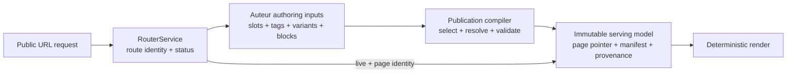
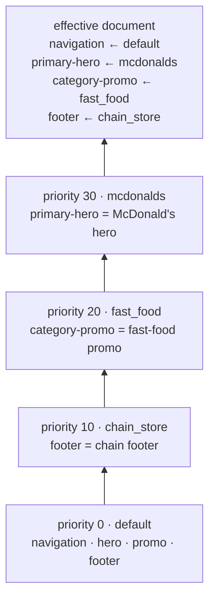
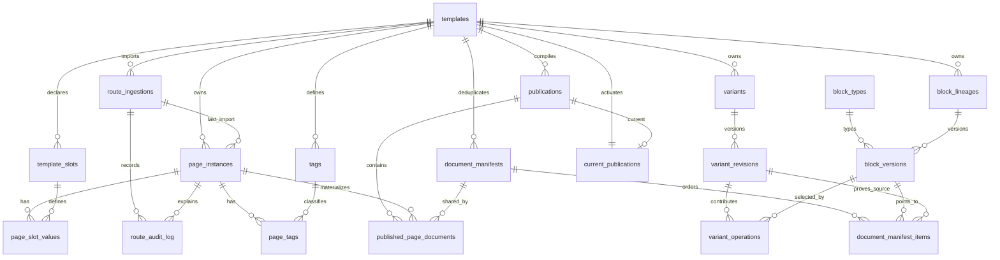
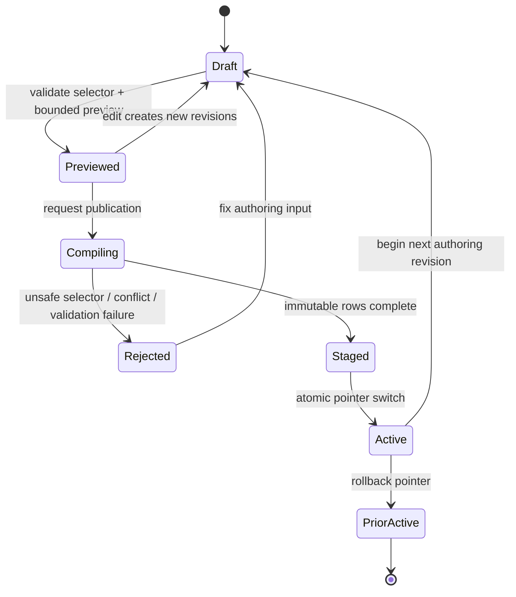
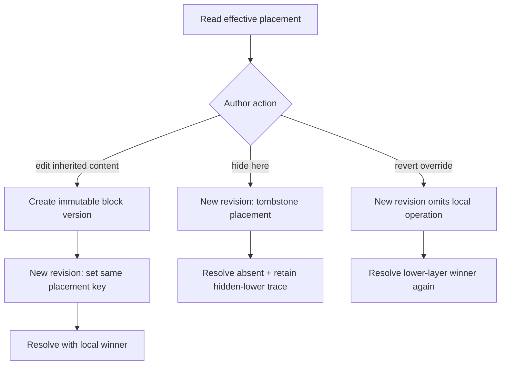
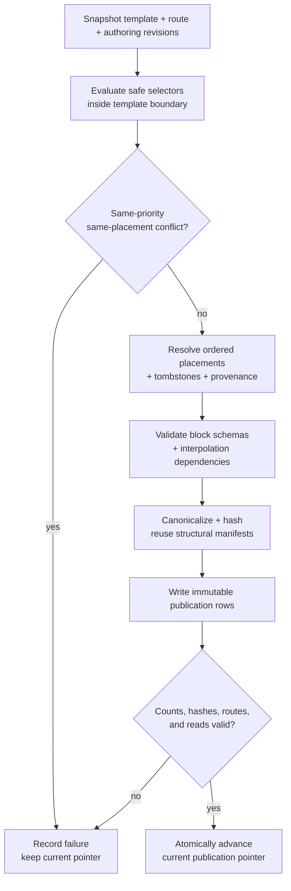
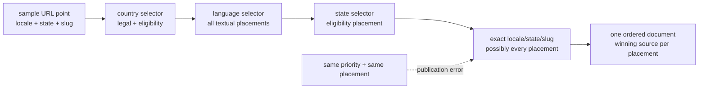
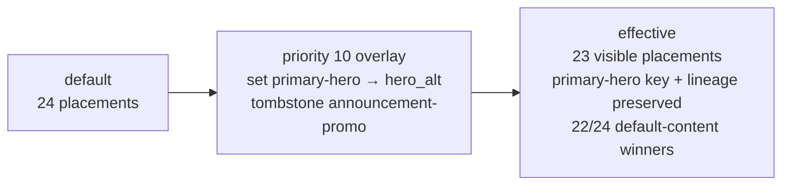
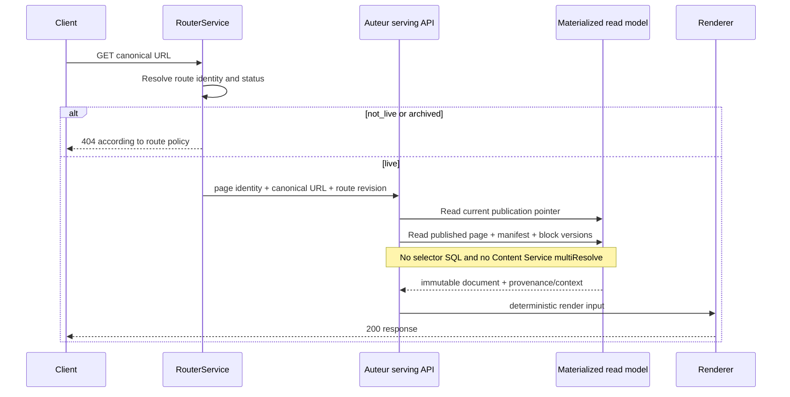

# Auteur process-engineering guide

Linear issue: [AUT-531](https://linear.app/harwood/issue/AUT-531/write-the-process-engineering-guide-for-reading-and-navigating-the)

This guide explains the model that the prototype is required to prove. It uses four labels to keep
evidence honest:

- **Requirement** — a product invariant that carries forward.
- **Prototype choice** — the current Bun/SQLite implementation, not automatically a production
  decision.
- **Measured finding** — a value reproduced in [the benchmark report](./benchmarks.md).
- **Open decision** — a production question that the prototype does not settle by itself.

No local timing or storage number should be treated as a production service-level objective.

## 1. Executive summary

Auteur replaces route-tree content overrides with template-scoped selector overlays. Each URL
template owns one default document. A concrete URL is one page instance described by scalar slot
values and independently assigned tags. A variant selects some of those page instances, has an
explicit integer priority, and contributes sparse operations to stable placement keys.

The authoring model is normalized, relational, layered, and intentionally inspectable. It can be
expensive. Publication is the compiler boundary: selectors are evaluated against a bounded,
approved read surface; conflicts are rejected; the winning placements and their provenance are
hashed; and immutable page-to-manifest rows are written. Public serving follows a current
publication pointer and performs no selector evaluation.

During the transition, RouterService still decides whether a route exists and is `live`, `not_live`, or
`archived`. Auteur owns content resolution and replaces Content Service's block `multiResolve` path for new
content. One canonical URL must map to one template, one page instance, and one effective document.
Here “canonical URL” means the normalized `https://{template.domain}{page.canonical_url}` identity;
the stored `canonical_url` column is an absolute path and may repeat on a different domain.



## 2. Spatial mental model

| Metaphor | Actual entity | Meaning | Where the metaphor stops |
| --- | --- | --- | --- |
| Wall of maps | `templates` | Every template is an isolated content space with its own URL grammar and default. | Maps have radically different cardinalities and are not comparable by physical area. |
| Point or tile | `page_instances` | One concrete canonical URL with scalar context and RouterService lifecycle state. | Instances do not have to form a complete rectangular grid. |
| Dimension | `template_slots`, `page_slot_values`, `tags`, `page_tags` | A selectable property of a page. | Slots are scalar; tags are many-to-many and can have several values in one namespace. |
| Transparent sheet | Default or non-default row in `variants`, plus `variant_revisions` and `variant_operations` | One selector-scoped layer of sparse placement decisions. | The sheet does not contain a cloned full document. |
| Vertical pin | Preview or publication resolution for one page | Collect matching layers in priority order and determine each winning placement. | The pin is an algorithm and provenance trace, not a stored hierarchy. |
| Projection | A bounded UI query over two chosen dimensions | Makes a higher-dimensional relation inspectable. | Omitted dimensions still constrain the result; the projection is not the full map. |
| Compilation | A `publications` run | Flattens layered authoring state into immutable serving rows. | Compilation is application-owned; it is not an ordinary database view. |

### One selected URL's layer stack

The Store fixture demonstrates composition: a McDonald's page matches three sparse variants, each
contributing a different placement.



## 3. Canonical vocabulary

| Term | Definition |
| --- | --- |
| Template | An isolated URL grammar and content map. It owns slots, page instances, block lineages, variants, and exactly one default. |
| Slot | An ordered static or variable URL segment, or a derived scalar dimension, declared by one template. |
| Page instance | One canonical domain/path identity and stable route identity belonging to exactly one template, with RouterService status and immutable-at-publication context. |
| Tag | A template-scoped classification value. A page can have many explicit tag memberships, each with source/provenance. |
| Selector | A bounded expression over an approved template-owned read surface. Authored literals are parameters; arbitrary SQL is not the language. |
| Variant | A template-scoped selector layer with an explicit priority and sparse operations. The default is the special priority-zero variant. |
| Priority | The explicit integer cascade order. Lower priorities apply first; priority never derives from selector complexity or row creation order. |
| Placement key | Stable identity for a conceptual document position, such as `primary-hero`, independent of list index, block type, and content version. |
| Block type | A registry entry defining a block's schema and editor contract, such as `hero` or `hero_alt`. |
| Block version | An immutable typed content value in a stable lineage. Content changes create a new version. |
| Overlay operation | A variant-revision decision targeting one placement: `set`, `tombstone`, or `order`. |
| Tombstone | An explicit local decision to keep a lower-layer placement absent. It is not the same as removing an override. |
| Publication | An immutable, versioned compilation result for one template and one snapshot of route and authoring inputs. |
| Manifest | A content-addressed ordered structure of placement keys and block-version pointers that many pages may share. |
| Effective document | The unique ordered set of visible placements produced for one page after matching layers are composed. |
| Provenance | The winning default or variant revision, priority, operation trace, and block version for each effective placement. |

## 4. How to read the ERD and tables

The schema separates authoring inputs on the left from published serving data on the right. A
foreign key pointing through `template_id` is a template-isolation boundary, not just a join
convenience.



### Row-by-row guide

“Mutable” below describes the intended service behavior. SQLite triggers and checks provide defense
in depth, but service APIs must enforce the same rules and tests must exercise direct database
writes where a trigger is expected.

| Table | What one row means / creator | Lifecycle | Keys and important indexes | Role in workflow |
| --- | --- | --- | --- | --- |
| `templates` | One URL grammar; platform setup creates it. | Mutable metadata; identity is stable. | PK `id`; unique `key` and `(domain,url_pattern)`; triggers require a normalized bare-host domain. | Root of all CRUD, resolution, and publication scope. |
| `template_slots` | One static, variable, or derived dimension; template author creates it. | Mutable during model setup; changes can invalidate all page inputs. | PK `id`; unique `(template_id,key)` and `(template_id,path_position)`; template/order index. | Defines URL parsing, input normalization, selector fields, and map projections. |
| `route_ingestions` | One RouterService/seed import attempt; ingestion worker creates and closes it. | Append-oriented; `source_observed_at` is immutable; `running` becomes `succeeded` or `failed`. | PK `id`; unique `(template_id,source,source_revision)`; required source-observation timestamp; template/status index. | Idempotency key, source freshness, and route-revision snapshot for import and publication. |
| `page_instances` | One canonical path and RouterService route identity; ingestion owns it. | Mutable authoring input; status is lifecycle-controlled by RouterService. | PK `id`; unique `route_external_id`, `(template_id,canonical_url)`, and slot-value hash; triggers enforce one same-domain path owner; `(template_id,route_status)` index. | Unit selected by variants and materialized by publication. |
| `page_slot_values` | One page's value for one template slot; ingestion derives it. | Replaceable when the authoritative route revision changes. | PK `(page_instance_id,slot_id)`; composite FKs keep page and slot in one template; selector index `(template_id,slot_id,normalized_value,page_instance_id)`. | Approved scalar selector surface and URL explanation. |
| `tags` | One explicit namespace/value definition; pipeline or author creates it. | Mutable label metadata; namespace/value identity is stable. | PK `id`; unique `(template_id,namespace,value)`; namespace lookup index. | Defines multi-valued selectable dimensions without hidden hierarchy inference. |
| `page_tags` | One explicit page-to-tag membership and its source; pipeline or author assigns it. | Add/remove as classification inputs change. | PK `(page_instance_id,tag_id)`; composite FKs enforce template scope; selector index `(template_id,tag_id,page_instance_id)`. | Tag selector membership in both preview and publication. |
| `route_audit_log` | One import decision for one route; ingestion creates it. | Immutable append-only record. | PK `id`; ingestion/time and page/time indexes. | Explains insert, update, status, skip, and error outcomes. |
| `variants` | One default or selector layer container; author creates it. | Mutable name, priority, status, and active-revision pointer. | PK `id`; unique `(template_id,key)`; partial unique default per template; resolution-order index. | Establishes explicit precedence and picks the immutable revision used for resolution. |
| `variant_revisions` | One immutable selector/configuration revision; authoring service creates it after validation. | Immutable after creation. | PK `id`; unique `(variant_id,revision_number)`; original input plus normalized SQL/hash and matching valid validation-result JSON; revision-order index. | Pins the accepted selector contract and owns sparse operations. |
| `block_types` | One schema/editor contract plus optional preview-renderer metadata; block-platform owner creates it. | Key/schema contract is immutable; preview metadata may evolve; existing block versions pin `schema_version`. | PK `id`; unique `key`; valid schema and preview-renderer JSON. | Validates content on create/update, chooses the authoring form, and declares preview rendering. |
| `block_lineages` | Stable identity for a conceptual block stream within one template; authoring creates it. | Stable; new content does not create a new lineage. | PK `id`; unique `(template_id,key)`; template index. | Groups immutable block versions and keeps template boundaries explicit. |
| `block_versions` | One immutable typed content value; create or copy-on-write creates it. | Immutable; never update or delete after publication use. | PK `id`; unique `(lineage_id,version_number)` and `(lineage_id,content_hash)`; optional earlier same-lineage `parent_version_id`; type and parent indexes. | Content pointer selected by default/variant operations and manifests; parent provenance explains a fork. |
| `variant_operations` | One `set`, `tombstone`, or `order` decision for a placement in a revision. | Versioned by its owning revision; must be frozen once the revision is active or published. | PK `id`; one local content op and one local order op per `(revision,placement)`; revision and block-version indexes. | Implements default document CRUD and sparse variant composition. |
| `publications` | One success or failed compile result for a template; publisher creates it. | Immutable; linked to the former publication as rollback target. | PK `id`; unique `(template_id,sequence)`; template/time index. | Records input hash, route revision, counts, failure detail, and publication lineage. |
| `document_manifests` | One unique structural document hash within a template; compiler creates it. | Immutable and content-addressed. | PK `id`; unique `(template_id,content_hash)`. | Deduplicates ordered placement structure across pages. |
| `document_manifest_items` | One ordered placement and its winning block/provenance in a manifest; compiler creates it. | Immutable. | PK `(manifest_id,placement_key)`; unique `(manifest_id,ordinal)`; block-version index. | Serving structure and per-placement provenance. |
| `published_page_documents` | One page's immutable pointer and resolved context inside one publication; compiler creates it. | Immutable. | PK `(publication_id,page_instance_id)`; unique `(publication_id,canonical_url)`; serve and manifest indexes. | Canonical URL/page lookup on the public path; contains no selector. |
| `current_publications` | The single active publication pointer for one template; publisher activates it. | Mutable only through atomic activation or rollback. | PK `template_id`; unique `publication_id`; composite FK verifies template ownership. | Makes activation and rollback a bounded pointer change. |

### Sample joined rows: `/en-US/store/1001`

These identifiers come from the deterministic SQLite foundation seed. They illustrate how several
normalized rows become one document; they are not benchmark results.

| Surface | Joined row(s) |
| --- | --- |
| Template | `tpl-store`, pattern `/{locale}/store/{store_id}` |
| Page | `page-store-1001`, RouterService identity `router-store-1001`, status `live`, route revision `store-seed-v1` |
| Slot values | `locale=en-US`, static `store`, `store_id=1001`, derived `store_name=McDonald's Market` |
| Context | `store.id=1001`, `store.name=McDonald's Market`, `store.location=San Francisco` |
| Tags | `store_type=chain_store`, `category=fast_food`, `brand=mcdonalds`; each membership source is `seed` |
| Matching layers | default priority 0; chain stores 10; fast food 20; McDonald's 30 |
| Publication | `publication-store-1` points the page to `manifest-store-mcd-v1` |

The manifest's winning placement rows are:

| Ordinal | Placement | Block version | Winning revision | Priority |
| ---: | --- | --- | --- | ---: |
| 0 | `navigation` | `block-store-navigation-v1` | `revision-store-default-1` | 0 |
| 1 | `primary-hero` | `block-store-hero-v2-mcd` | `revision-store-mcdonalds-1` | 30 |
| 2 | `category-promo` | `block-store-promo-v2-fast` | `revision-store-fast-food-1` | 20 |
| 3 | `footer` | `block-store-footer-v2-chain` | `revision-store-chain-1` | 10 |

Deterministic interpolation evaluates the winning hero against the immutable page context, yielding
content specific to this URL without cloning the hero's structural manifest per page.

## 5. Authoring workflows

### 5.1 Create a template and default document

1. Create `templates` and ordered `template_slots` rows.
2. Create exactly one `variants` row with `is_default=1` and priority `0`.
3. Create block lineages and immutable version-one block rows.
4. Create a default `variant_revisions` row whose selector matches the whole template.
5. Add `set` and `order` operations for each placement key, then activate that revision.
6. Health checks reject a template with no default; the database rejects a second default.

The default belongs only to this template. It must never contribute to another template's page.

### 5.2 Add and tag page instances

1. Begin a `route_ingestions` attempt keyed by RouterService source revision and record the immutable time
   that source revision was observed.
2. Upsert each `page_instances` identity, canonical URL, status, and context.
3. Replace normalized `page_slot_values` for that route revision.
4. Upsert explicit `tags` and `page_tags`, retaining each assignment's source.
5. Append a `route_audit_log` row for every insert, update, status transition, skip, or error.
6. Close the ingestion. Replaying the same source revision must not duplicate pages or memberships.

`archived` is a guarded soft-delete state. Import must not casually reactivate it. `not_live` exists
but is gated to `404`; the production decision about whether to materialize it remains explicit.

### 5.3 Create a selector and preview matches

The executable selector language is deliberately smaller than SQL: approved field comparison,
`IN`, `AND`, `OR`, and parentheses. A tag projection can appear as a multi-valued approved field,
for example `tags = 'mcdonalds'`; an implementation may lower it to an indexed membership
`EXISTS` query.

1. Tokenize and parse to an AST with length and token limits.
2. Reject SQL keywords, comments, multiple statements, unsupported operators, and unknown fields.
3. Normalize commutative expressions to stable text and a stable hash.
4. Compile only allowlisted identifiers and bind every author value as a parameter.
5. Inject the owning `template_id`; it is never author-controlled.
6. Preview with pagination or a hard sample limit and expose `EXPLAIN` plus overlap diagnostics.

Selector execution is allowed only for preview and publication. It is forbidden on the public
request path.

### 5.4 Create a linked variant

Create a non-default `variants` row and an immutable selector revision with no placement operations.
Reading the authoring document still resolves and displays the whole lower document, marking every
placement inherited. No block row is cloned until the author changes content.

An explicitly empty variant is a distinct author choice and must not be confused with a newly
linked variant.

### 5.5 Edit inherited content through copy-on-write

1. Read the inherited placement and its winning block version.
2. Validate the edited content against the chosen block type schema.
3. Create a new immutable `block_versions` row, retaining or intentionally changing lineage.
4. Add a local `set` operation for the same placement key in a new variant revision.
5. Re-resolve. Only pages matching the variant see the new version; the default remains unchanged.

### 5.6 Hide a block with a tombstone

Add a `tombstone` operation at the local revision. Resolution records the hidden lower placement in
the trace but omits it from the effective document. A higher-priority `set` may intentionally
reintroduce the placement.

### 5.7 Revert an override

Create a new variant revision without that placement's local operation. The lower winner becomes
visible again. Revert deletes the *decision in the new draft*, not an immutable historic operation
or block version.

### 5.8 Replace a block type without changing placement identity

Create a new typed block version, then `set` it at the existing placement key. For example,
`primary-hero` can change from `hero` to `hero_alt`; provenance and diffs still refer to the same
conceptual position. An independent `order` operation changes display order without creating a
content version.

### 5.9 Publish, inspect provenance, and roll back

Publication snapshots input revisions, evaluates selectors, rejects conflicts, resolves every
eligible page, validates schemas and interpolation dependencies, deduplicates manifests, writes
immutable rows, validates counts and hashes, then advances `current_publications` atomically.
Rollback advances that pointer to a retained prior publication; it does not rewrite either result.

### 5.10 Execute the workflow in the prototype HUD

The **Block authoring** tab on each template route is an executable bounded workbench, not a local
React-only simulation. Route loaders and mutations cross Zod-validated TanStack server functions,
open the configured SQLite database only on the server, and delegate every command to
`CmsService`. The Store workbench uses the deterministic foundation seed; the Eligible Vehicles
and structural workbenches idempotently install compact, editable rows that preserve their proof
contracts. The explanatory map, million-cardinality labels, and historical comparison cards remain
fixtures and do not pretend to be the benchmark database.

The persisted controls cover the complete author loop: default placement add/reorder/edit/type
replacement/delete; linked or explicitly empty variant creation; bounded selector preview and
revision; priority change; inherited copy-on-write; scoped tombstone and revert; atomic publish;
and pointer-only rollback. A write and its refreshed resolution projection share one outer SQLite
transaction, so a conflict discovered while building the response rolls the write back too. Each
successful mutation returns a fresh projection containing the effective placements, rendered
value, separate content/order provenance, tombstones, active publication ID, exact rollback target,
document hash, and publication count. The three scenario routes therefore remain independently
editable, publishable, and resolvable without adding scenario branches to the resolver or
publisher.



### Copy-on-write, tombstone, and revert



### 5.11 Publish into the standalone website

The repository has two intentionally separate TanStack Start applications. `apps/cms` is the
authoring and publication HUD on port `3000`; `apps/website` is the rendering surface on port
`3001`. This keeps the useful part of Median's hybrid topology—a separate admin entry, an
explicit preview namespace, a catch-all page route, and a block registry—without carrying over its
remote fetch, CEL, Supabase, auth, or route-tree inheritance model.

The executable path is:

```text
CMS authoring mutation
  → selector-bounded draft resolution
  → atomic publication + current_publications pointer
  → website canonical-pattern registry
  → readonly CmsService.serve(template, canonical URL)
  → PublishedDocumentSchema
  → synchronous block registry
  → cacheable HTML + publication/hash provenance
```

The public catch-all recognizes exactly the three proof grammars and dispatches each grammar to one
template. `CmsService.serveWithEvidence` reads the current RouterService-owned `route_status` and active
publication pointer in the same materialized query. Expanded documents require that single query;
manifest documents add one ordered manifest/block query. Both shapes execute zero selector
statements. The website calls `serve`, validates the returned value at the shared
`PublishedDocumentSchema` boundary, and dispatches `navigation`, `hero`, `hero_alt`, `promo`, and
`footer` synchronously by block type. Placement keys remain DOM-visible and provenance remains
inspectable, so a block-type replacement changes the renderer without changing placement identity.

Public URLs cannot enter authoring mode: adding `?edit_mode=true` does not alter their publication
ID, document hash, cache policy, or data path. Draft resolution exists only under
`/cms-preview_/*`, sends `private, no-store` plus `noindex` headers, validates the canonical host,
and is disabled by default in production. `/admin` validates `CMS_ADMIN_ORIGIN` and offers a link
to the separate CMS; it is not an iframe, reverse proxy, auth boundary, or alternate content API.
These are prototype seams, not claims that production preview authorization or proxying is
complete.

## 6. Resolution and conflict rules

For one page and one template, resolution is:

1. Load the complete default document at priority `0`.
2. Evaluate active, template-owned selectors on the approved preview/publication surface.
3. Collect matching variant revisions and reject duplicate variant IDs or invalid operations.
4. Before applying anything, group operations by `(priority, placement_key)`. If two matching
   variants in one group touch that placement, fail; timestamps, row IDs, selector specificity, and
   SQL return order are never tiebreakers.
5. Apply variants from low to high priority. Within a layer, operation order is canonicalized.
6. `set` replaces or introduces content; `tombstone` makes it absent; `order` changes ordering but
   requires a visible target. Content provenance and order provenance remain independent.
7. Sort visible placements by `(order, placement_key)` and tombstones by placement key.
8. Canonically encode the effective value and hash it. Identical inputs must yield identical bytes,
   IDs, order, hashes, and provenance regardless of database row-return order.



### Selector safety boundary

- Authors never submit a `SELECT` statement.
- Only allowlisted scalar/tag fields become identifiers; all values become parameters.
- Template ownership is injected outside the AST.
- DDL, DML, `PRAGMA`, attached databases, comments, multiple statements, unauthorized tables, and
  unsupported operators fail before a database call.
- Preview has input, token, row, and time bounds. Publication runs in a worker, not a request.
- The serving database role needs only the materialized tables and current pointer.

## 7. Three proof scenarios

The scenario status and measured values live in [the benchmark report](./benchmarks.md). The traces
below define what must be observable from selector to winning provenance.

### Dense Eligible Vehicles (`AUT-527`)

Pattern: `/{locale}/eligible-vehicles/{state}/{slug}`. Locale, country, language, state, and slug can
all alter content; exact intersections may override every placement. This stresses deterministic
precedence and author comprehension when little content is shared.



Required trace for a sampled URL:

```text
page slots/tags
  → every matching normalized selector and match cardinality
  → ordered priorities
  → every operation considered at each placement
  → one winning source or one explicit tombstone
  → effective document hash and published hash
```

The executable scenario and persisted service proof produce the selector-to-provenance trace,
repeatable hashes, manifest metrics, indexed preview evidence, and an injected same-priority
conflict that leaves the former publication pointer and row count unchanged. Exact run timings and
host metadata live in the generated evidence envelopes linked from the benchmark report.

### Sparse Stores at scale (`AUT-528`)

Pattern: `/{locale}/store/{store_id}`. A Store page can match independent tag dimensions:

```text
tags = 'chain_store'  → footer
tags = 'fast_food'    → category-promo
tags = 'mcdonalds'    → primary-hero
tags = 'burger_king'   → primary-hero
```

For `/en-US/store/1001`, the expected winners are the four manifest rows in the McDonald's example
above. The deterministic seed separately proves independent, chain/non-fast-food,
generic-fast-food-chain, McDonald's, and Burger King classes without a scenario-specific resolver
branch. Independent restaurants retain the full default. This stresses million-row selection,
many-to-many tag indexes, sparse composition, deterministic interpolation, and manifest reuse.

`bun run scenarios:benchmark:1m` uses the generic `CmsService` preview/publication path and records
the exact one-million-row outcome—or an exact resource failure—in the evidence ledger. This guide
does not duplicate timing values that can drift between hosts.

### Structural block replacement (`AUT-529`)

The automated domain fixture starts with 24 placements. Priority `10` replaces the content at
`primary-hero` from `hero` to `hero_alt` without changing the placement key or lineage and
tombstones `announcement-promo`. The result retains the exact default block-version pointer and
default content provenance for 22 of the original 24 placements: `22 / 24 = 91.67%`, satisfying the
`>= 90%` inheritance contract.



The same contract runs both as a domain proof and through persisted service publication, including
stable placement identity, tombstone behavior, exact provenance, and pointer rollback. The
benchmark report distinguishes these deterministic counts from host-dependent timing/storage
measurements.

## 8. Transitional service architecture



The transition interface must carry a stable page/route identity, canonical URL, lifecycle status,
and route revision. Publication stores the route revision it compiled. If RouterService reports a newer or
incompatible revision, Auteur must follow an explicit stale-content policy rather than silently
serving an untraceable mix. A future Auteur takeover can replace the RouterService adapter while preserving
the same route-authority contract; takeover is outside this prototype.

For the standalone proof, the `website` server function occupies the Auteur serving/renderer side
of the diagram. It opens SQLite read-only, rejects unsupported URL grammars and mismatched
production hosts, calls only the materialized serving service, validates the immutable document,
and returns cache metadata. The browser bundle receives only the validated document view model; it
does not contain SQLite, selector, publication, or draft-resolution code.

## 9. Decisions, tradeoffs, and open questions

The production recommendation is developed in
[ADR 0001](./adr/0001-tidb-materialization.md). The benchmark report is its evidence ledger.

| Topic | Established requirement | Prototype choice | Open production decision |
| --- | --- | --- | --- |
| Materialization | Public requests execute no selector SQL. | Application-owned SQLite publication tables and a current pointer. | TiDB chunk size, orchestration, and database-side `INSERT … SELECT` boundary. |
| Manifest versus expanded payload | Every URL has one immutable effective result. | Structural manifests plus per-page context and optional rendered JSON. | Render-time interpolation versus publish-time expansion, decided by measured bytes and read complexity. |
| Full versus incremental publication | Activation is atomic and rollback preserves exact prior hashes. | Full-template reasoning is the correctness baseline. | Safe dependency-driven invalidation after a TiDB proof. |
| Priority | Same-priority overlap on one placement fails. | Explicit positive integers; default is `0`. | UI may suggest priorities/specificity but may never silently decide them. |
| Slot storage | Template isolation and selector safety remain explicit. | Normalized `page_slot_values` and `page_tags`. | Generated/wide columns or derived read surfaces for hot TiDB dimensions. |
| Expressions | Evaluation is deterministic and code-free. | Restricted dotted-path interpolation against JSON context. | Publish-time expansion, render-time evaluation, or a measured hybrid. |
| Route state | RouterService is route existence/status authority during transition. | Service proofs return `200` for `live` and `404` for `not_live`/`archived`; the scale publisher compiles the eligible fixture rows. | Whether production `not_live` pages are precompiled, retained from a former publication, or omitted. |
| Tag ownership | Membership and source are explicit; no hidden hierarchy inference. | `pipeline`, `author`, or `seed` provenance per definition/assignment. | Conflict policy, freshness SLA, and whether authors can override pipeline assignments. |
| Constraints | Canonical domain/path uniqueness, one default, template-scoped FKs, and immutability are mandatory. | SQLite checks, indexes, composite FKs, and triggers. | Which selected TiDB version enforces directly versus service API, grants, and audit checks. |

### Review checklist

A reviewer should be able to answer “yes” to each question:

- Can I identify the template boundary for every row in a trace?
- Can I explain why hide and revert have opposite outcomes?
- Can I replace a block type without changing the placement identity?
- Can I name the only legal precedence input: explicit priority?
- Can I locate one content source and one order source for every visible placement?
- Can I show that a failed publication leaves the former current pointer unchanged?
- Can I trace a public request without finding selector evaluation, while locating manifest-mode interpolation against immutable context?
- Can I distinguish executable behavior from a proposal that is not present in the repository?

## Tutorial learning contract

[AUT-537](https://linear.app/harwood/issue/AUT-537/polish-tutorial-math-semantic-typography-and-retrieval-practice)
makes `/tutorial` a practice surface for learning and re-explaining this model. It does not add a
new CMS persistence or publication concern.

[AUT-545](https://linear.app/harwood/issue/AUT-545/refocus-the-tutorial-on-the-current-executable-architecture)
keeps that practice surface current-code-only. The curriculum begins with concrete repository
paths, follows one canonical URL through the implemented SQLite/service/publication/website flow,
and tests only behavior that exists in code. Historical provenance remains in its governed records,
not in the reader's prerequisite path.

The Markdown renderer preserves document meaning instead of flattening every token into the same
visual treatment. Heading levels remain navigable; bold, italic, and highlighted passages keep
their native emphasis semantics; inline and fenced code use the mono role; explanatory prose and
quotations use appropriate sans and serif roles; and each architecture graphic is a semantic
`figure` with a `figcaption`. Comparison graphics also expose their values as text or a table, so
their argument remains available without relying on color, canvas pixels, or spatial position.

Math has one authoring contract:

| Meaning | Canonical Markdown | Rendering path |
| --- | --- | --- |
| Inline expression | `$M_v$` | `remark-math` to KaTeX inline output and MathML |
| Display expression | `$$` on delimiter lines around the expression | `remark-math` to KaTeX display output and MathML |

Do not use `\[` and `\]` as display delimiters in tutorial Markdown. They are TeX delimiters, but
they are not the Markdown contract parsed by `remark-math`; leaving them in source can expose the
raw expression in the lesson.

Every chapter follows reading with an official shadcn Questionnaire knowledge check. Questions
exercise three complementary retrieval moves: recall the invariant, distinguish it from a nearby
but incorrect model, and apply or diagnose it in a concrete CMS situation. Feedback explains the
reasoning rather than reducing the exercise to a score. A separate teach-back deck asks the reader
to reconstruct the architecture in their own words and schedules cards by due state before
introducing new prompts.

Questionnaire attempts are deliberately ephemeral page-session state. Spaced-repetition scheduling
is browser-local learning state, validated against a versioned progress shape and stored locally.
Neither enters `@repo/cms-db`, SQLite migrations, selector evaluation, publication hashes, or
serving documents. Resetting or losing that state affects only the learner's practice history. This
separation keeps the tutorial useful for rehearsal without creating a second, accidental content
model.

## Linear traceability

- Model and transition: `AUT-514`–`AUT-519`
- Selector, blocks, CRUD, resolution, and publication: `AUT-520`–`AUT-525`
- HUD and scenarios: `AUT-526`–`AUT-529`
- Evidence, this guide, and production ADR: `AUT-530`–`AUT-532`
- Tutorial transfer and reviewed walkthroughs: `AUT-533`
- Standalone publication rendering and isolated hybrid seams: `AUT-534`–`AUT-536`
- Tutorial math, semantic presentation, knowledge checks, and retrieval practice: `AUT-537`
- Current-code-only tutorial curriculum and regression guard: `AUT-545`

The CMS project in Linear remains authoritative when this guide and an issue differ.
